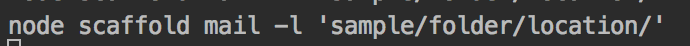
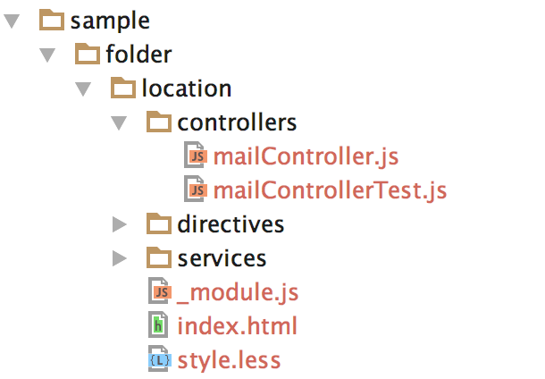

# aconex-ui-scaffolding [![NPM version][npm-image]][npm-url] [![Build Status][travis-image]][travis-url] [![Dependency Status][daviddm-image]][daviddm-url] 
> 

## Installation

```sh
$ npm install --save aconex-ui-scaffolding
```

## Usage
Add github url inside package.json and type

```js
scaffold <moduleName> -l <location>
Ex:-
scaffold mailsearch -l 'mail/search/'
```

##Screenshots
Command



Folder Structure



##ToDo

1. Write Unit Tests
2. Add more feature like able to add `directives` and `services`

        Example: scaffold directive:tool -l<path> //Generate folder and template for the directive.
        
## License
Copyright (c) 2016 . Licensed under the MIT license. © [ArPiT](https://github.com/arpit2438735/)


[npm-image]: https://badge.fury.io/js/aconex-ui-scaffolding.svg
[npm-url]: https://npmjs.org/package/aconex-ui-scaffolding
[travis-image]: https://travis-ci.org/arpit2438735/aconex-ui-scaffolding.svg?branch=master
[travis-url]: https://travis-ci.org/arpit2438735/aconex-ui-scaffolding
[daviddm-image]: https://david-dm.org/arpit2438735/aconex-ui-scaffolding.svg?theme=shields.io
[daviddm-url]: https://david-dm.org/arpit2438735/aconex-ui-scaffolding
[coveralls-image]: https://coveralls.io/repos/arpit2438735/aconex-ui-scaffolding/badge.svg
[coveralls-url]: https://coveralls.io/r/arpit2438735/aconex-ui-scaffolding
